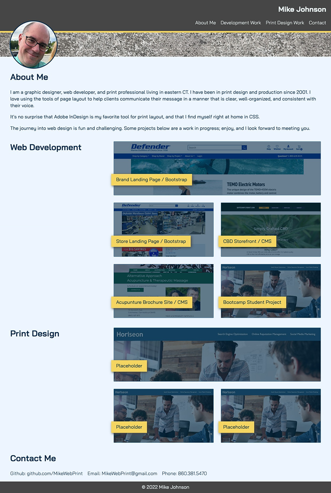

# <Your-Project-Title>

## Mike Johnson Portfolio

This portfolio project offers a snapshot into my professional skills and body of work.  It is by no means exhaustive, but allows me the opportunity to share what I've done and can do for prospective employers and clients.

It also presents a challenge to myself to expand on what I feel comfortable tackling, and honing the tools at my disposal. Building this portfolio page tested what I thought I knew about CSS, and forced me to practice debugging, reviewing code, re-writing, and reviewing again.

I approach the styling of this as a creative process; what I find charming today may feel worn out tomorrow, and so I expect to keep modifying this portfolio as time goes on, both in the projects I include and how I present them.

In this round, I learned some of the pitfalls of using scale transformation on hover, and the ways in which if it is done poorly can make for a jarring using experience. I learned how to push a footer to the bottom of any viewport regardless of content length, and got to practice creating CSS custom variables. I also learned about the HTML scroll-behavior attribute.

I enjoyed making decisions on hover behavior and colors.  I found it frustrating debugging the .card:before::hover rules that broke the layout when I didn't have the declarations just right.

## Installation

At this point, the project is a static HTML document, and there is no need for any installation to visit the page. You can  [view my portfolio here](https://mikewebprint.github.io/Portfolio/).

## Usage

I've included a screenshot of how this page is expected to display on desktop, see below:

I decided that on smaller width displays, the card layout should collapse to all one column at full width.

## Credits

I built this portfolio page on my own, drawing from what I learned in the UCONN coding bootcamp, as well as many tutorials, books and videos I've taken in over the last few years.  Of course, I did my fair share of Googling to get this page just right, and found many helpful tips on W3Schools, Stack Overflow, the MDN documents, and CSS-Tricks, to name a few.

I would like to thank the employers and clients that I have worked with that entrusted me to create the work that I have presented here.

## License

There is no license for this project, but all copyrights are reserved. The content of the websites and projects I've linked to here are the property and responsibility of their owners.